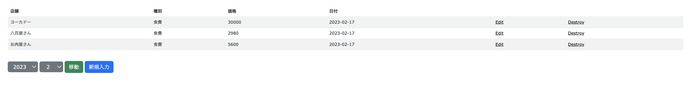

<!-- TOC -->

- [Rails の全部盛りリポジトリ](#rails-の全部盛りリポジトリ)
- [家計簿機能画面](#家計簿機能画面)
- [家計簿機能参考記事](#家計簿機能参考記事)
- [エラー](#エラー)
  - [NoMethodError: undefined method \`match' for nil:NilClass](#nomethoderror-undefined-method-match-for-nilnilclass)
    - [内容](#内容)
    - [対応](#対応)
  - [WARN rbenv: 2.4.1 is not installed or not found in $HOME/.rbenv/versions/2.4.1 on IP アドレス](#warn-rbenv-241-is-not-installed-or-not-found-in-homerbenvversions241-on-ip-アドレス)
  - [cap aborted! SSHKit::Runner::ExecuteError: Exception while executing as](#cap-aborted-sshkitrunnerexecuteerror-exception-while-executing-as)
  - [bundle exec cap production deploy:db_create ができない](#bundle-exec-cap-production-deploydb_create-ができない)
  - [bundler のバージョンがあっていても can't find gem bundler](#bundler-のバージョンがあっていても-cant-find-gem-bundler)
- [デプロイ参考記事](#デプロイ参考記事)
- [bundler のバージョン切り替え（2.3.26 にしたい場合）](#bundler-のバージョン切り替え2326-にしたい場合)
- [デプロイコマンド](#デプロイコマンド)
- [webpacker のエラー ERR_OSSL_EVP_UNSUPPORTED でデプロイできない](#webpacker-のエラー-err_ossl_evp_unsupported-でデプロイできない)
- [git@github.com: Permission denied (publickey). でデプロイできない](#gitgithubcom-permission-denied-publickey-でデプロイできない)
- [デプロイエラー Compilation failed: Browserslist: caniuse-lite is outdated. Please run: npx update-browserslist-db@latest](#デプロイエラー-compilation-failed-browserslist-caniuse-lite-is-outdated-please-run-npx-update-browserslist-dblatest)

<!-- /TOC -->

# Rails の全部盛りリポジトリ

TODO: リポジトリ名変更

- 個人用ツール
- ライブラリの動作確認
- 実装試しうち
- 設計(必要ならブランチごとにかえる、その場合別ブランチは継続運用するというより単一の変更を試すために使う。色々合わせた確認がしたいならそれ用に作る)
- 試したソースコードなどにコメントや、ドキュメントを細かくつけて再利用可能にする

# 家計簿機能画面



# 家計簿機能参考記事

- [Rails scaffold を初心者向けに解説！実際にアプリを作ってみよう！](https://udemy.benesse.co.jp/development/system/scaffold.html)
- [Ruby on Rails 4 と Bootstrap で管理画面のレイアウトを作成する](https://www.imd-net.com/column/2760/)

# エラー

## NoMethodError: undefined method `match' for nil:NilClass

### 内容

```sh
$ bundle exec cap production deploy
(Backtrace restricted to imported tasks)
cap aborted!
NoMethodError: undefined method `match' for nil:NilClass
```

### 対応

IP アドレスの環境変数`SERVER_IP`未指定が原因だったので、

```sh
bundle exec cap production deploy SERVER_IP=IPアドレス
```

で一旦動作することを確認。環境変数に入れるようにする。

## WARN rbenv: 2.4.1 is not installed or not found in $HOME/.rbenv/versions/2.4.1 on IP アドレス

`config/deploy.rb`で`set :rbenv_ruby, '2.5.1'`として解決。

## cap aborted! SSHKit::Runner::ExecuteError: Exception while executing as

```bash
ssh-add ~/.ssh/id_rsa
```

で解決。

## bundle exec cap production deploy:db_create ができない

直接サーバーで SQL を実行。

## bundler のバージョンがあっていても can't find gem bundler

```bash
bundler:config
$HOME/.rbenv/bin/rbenv exec bundle config --local deployment true
/home/jun/.rbenv/versions/2.5.1/lib/ruby/2.5.0/rubygems.rb:289:in `find_spec_for_exe'
:
can't find gem bundler (>= 0.a) with executable bundle
 (
Gem::GemNotFoundException
```

必要なデプロイの設定の修正を git push できていなかっただけ。push して解決。  
（やはり上手くいかないなら、手順書レベルの基本を見直すべき）

# デプロイ参考記事

- [(初心者向け）vps を契約して、capistrano3 で Rails アプリをデプロイするまで [その 1 サーバー設定編]](https://qiita.com/ryo2132/items/f62690f0b16ec11270fe)
- [(初心者向け）vps を契約して、Capistrano3 で Rails アプリをデプロイするまで [その 2 ローカル設定編]](https://qiita.com/ryo2132/items/03f5f52b43742f5aef10)

# bundler のバージョン切り替え（2.3.26 にしたい場合）

```bash
gem install bundler -v 2.3.26
bundle _2.3.26_ --version
```

# デプロイコマンド

```
bundle exec cap production deploy
```

# webpacker のエラー ERR_OSSL_EVP_UNSUPPORTED でデプロイできない

https://www.nslabs.jp/rails-switch-from-webpacker-to-jsbundling-rails.rhtml

# git@github.com: Permission denied (publickey). でデプロイできない

[参考](https://stackoverflow.com/questions/7968656/why-is-a-cap-deploy-giving-permission-denied-publickey)

```bash
ssh-add -k
```

# デプロイエラー Compilation failed: Browserslist: caniuse-lite is outdated. Please run: npx update-browserslist-db@latest

node が新しいことによって起きている。
deploy.rb に以下を追加することで解決。

```ruby
# 環境変数の設定
set :default_env, {
  'NODE_OPTIONS' => '--openssl-legacy-provider'
}
```
